# 🔴 AI-Powered Surveillance System for Anomaly Detection

> A real-time AI surveillance system that automatically detects violent activity from live camera feeds, saves incident evidence to the cloud, and instantly alerts security teams via email and SMS.

---

## 📸 Screenshots of the Web Application
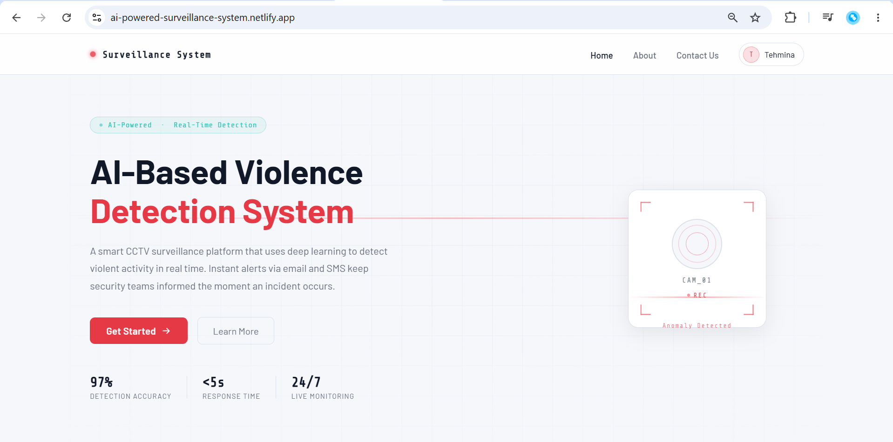
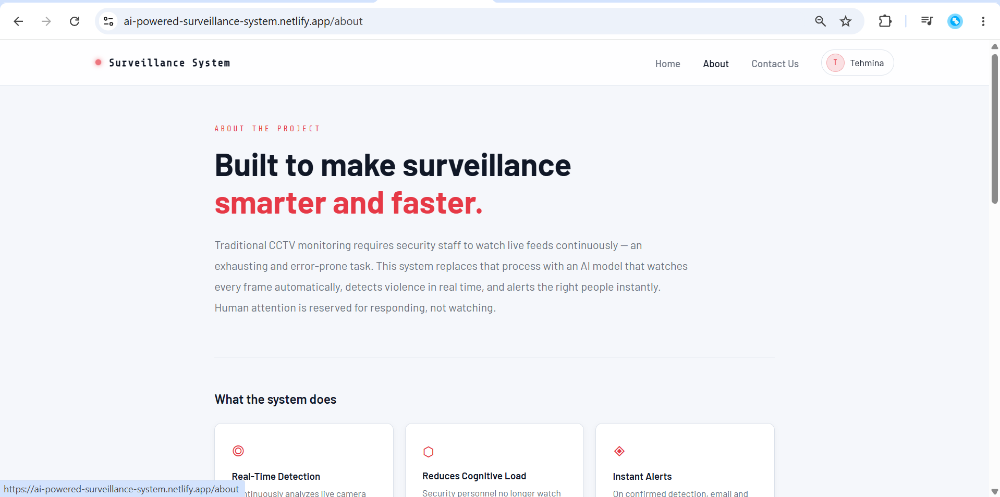
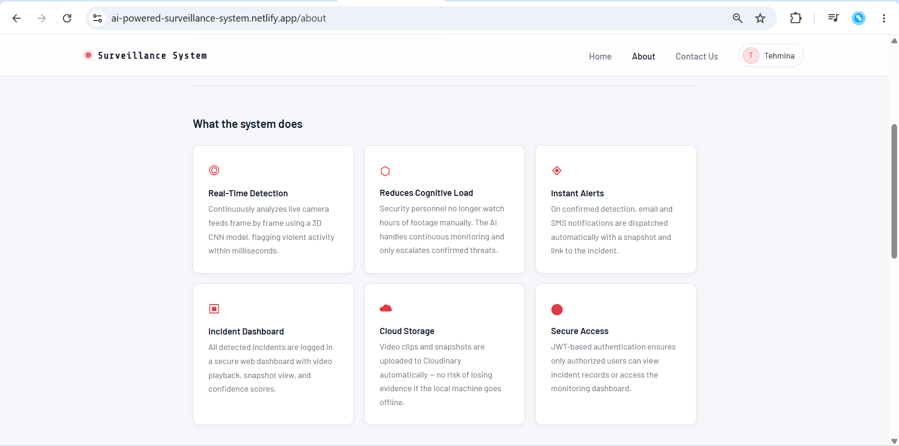
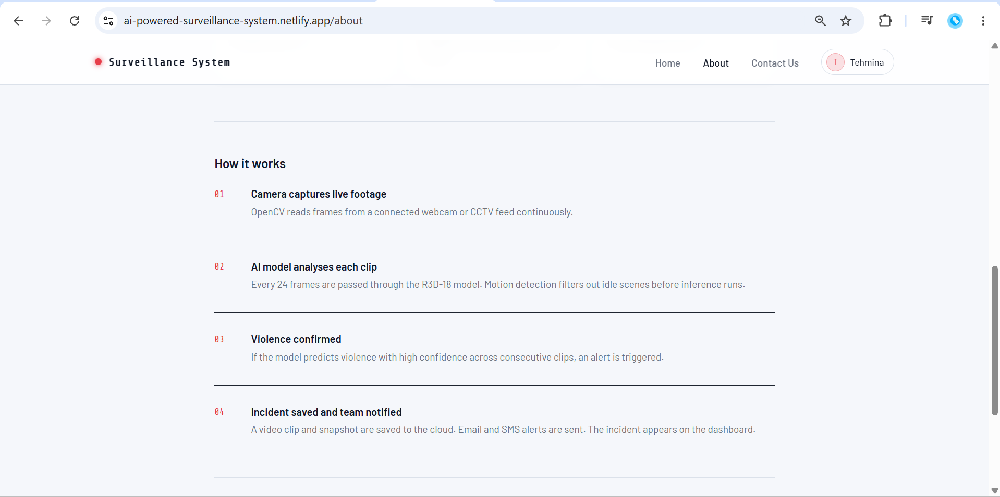
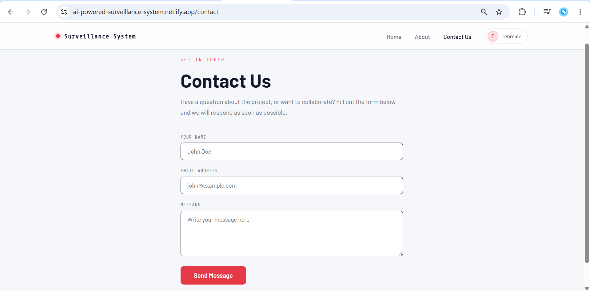
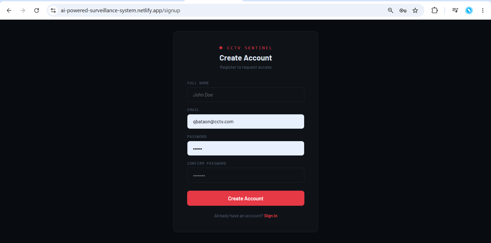
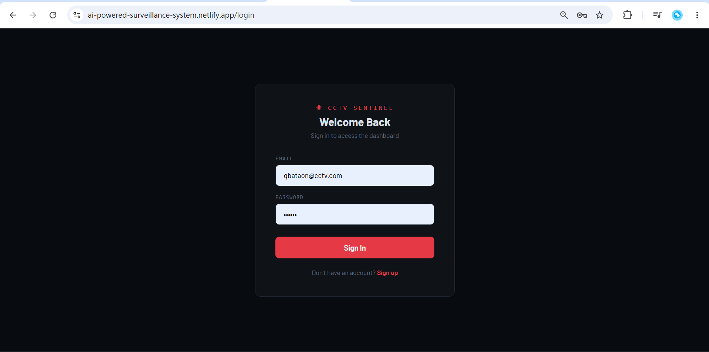
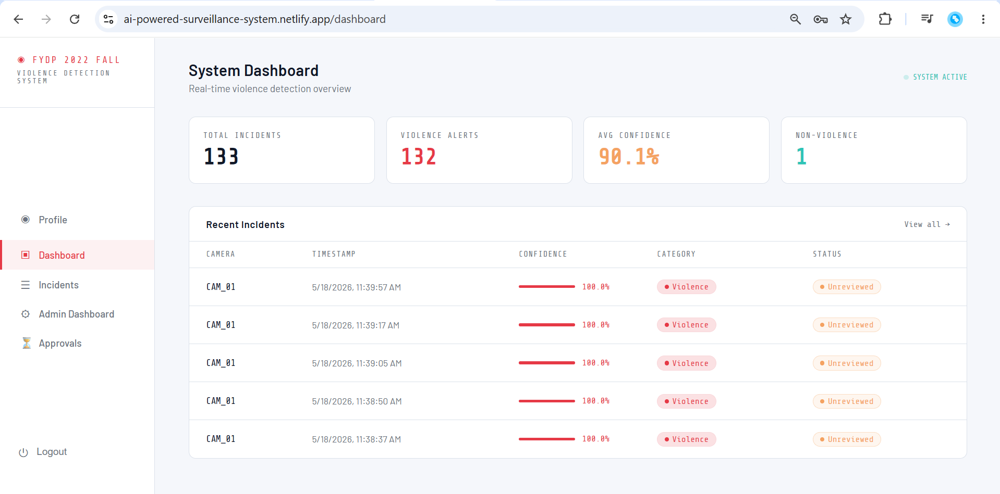
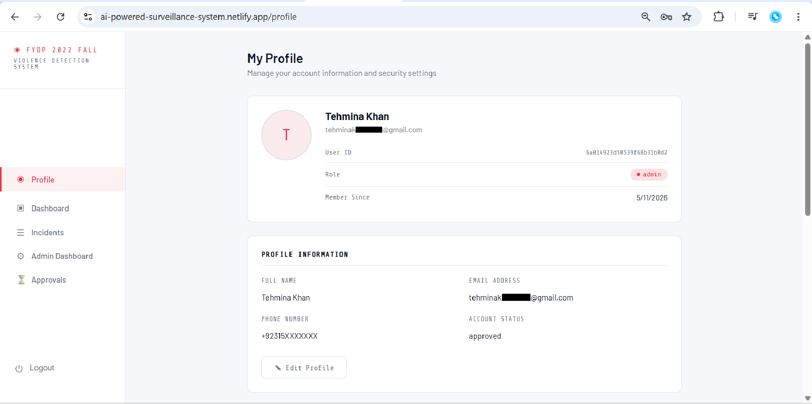
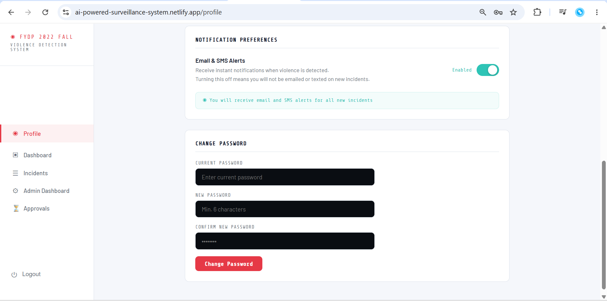
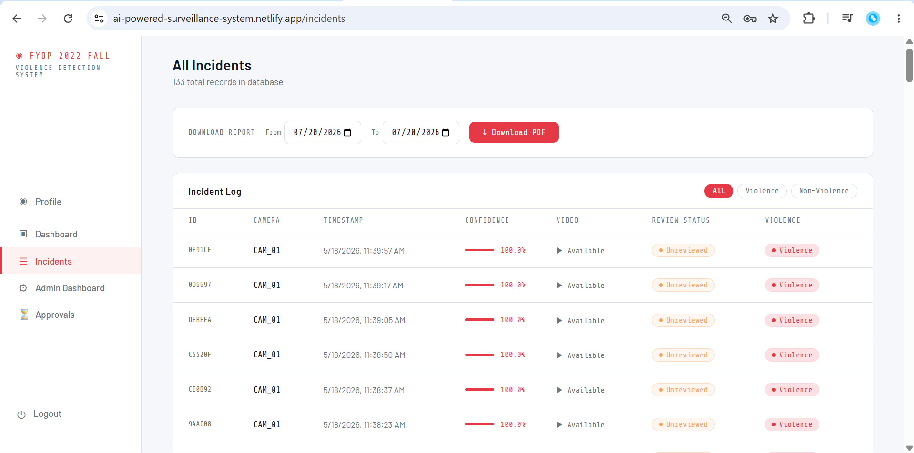
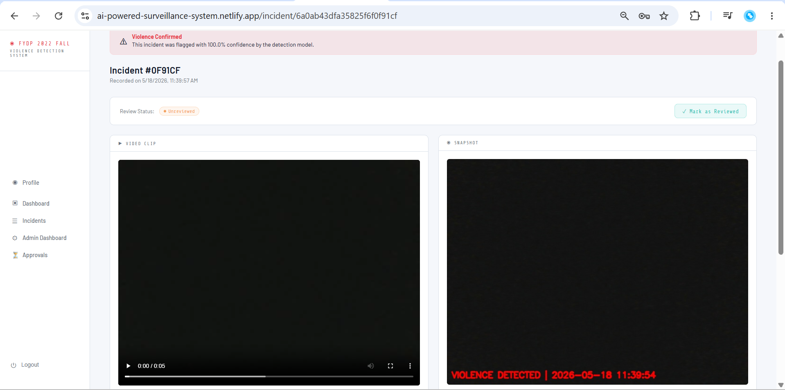
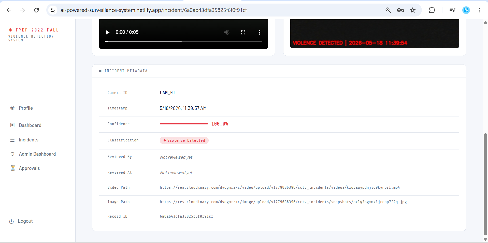
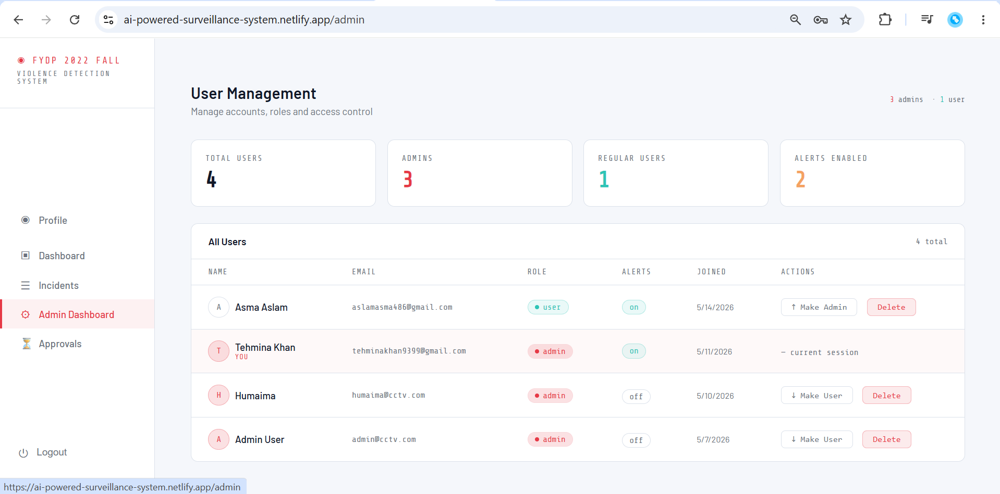
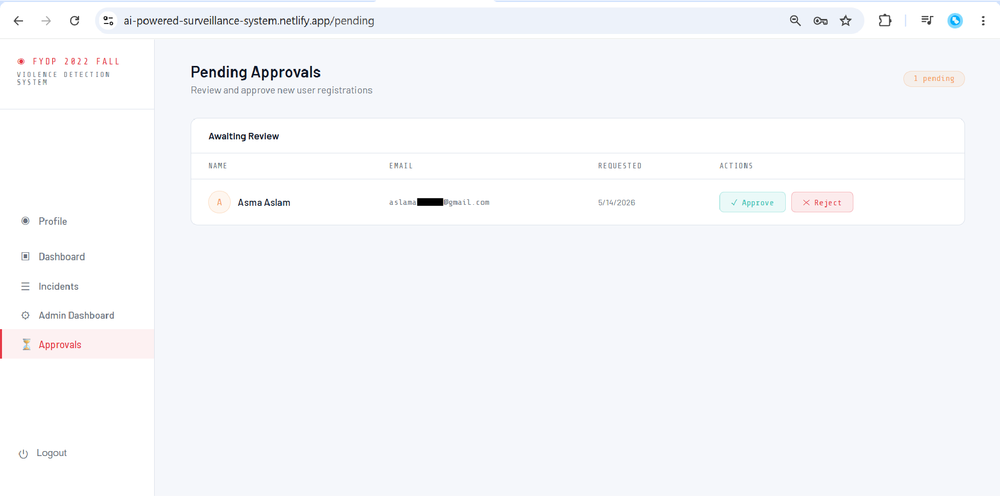

---

## 📌 Table of Contents

- [Overview](#overview)
- [Features](#features)
- [System Architecture](#system-architecture)
- [Tech Stack](#tech-stack)
- [Getting Started](#getting-started)
  - [Prerequisites](#prerequisites)
  - [Installation](#installation)
  - [Environment Variables](#environment-variables)
  - [Running the System](#running-the-system)
- [Project Structure](#project-structure)
- [API Reference](#api-reference)
- [ML Model](#ml-model)
- [Deployment](#deployment)
- [Team](#team)

---

## Overview

AI-Powered Surveillance System for Anomaly Detection is a Final Year Project (FYP) that addresses a critical limitation of traditional surveillance systems — the need for humans to watch hours of CCTV footage continuously. This system replaces that with an AI model that monitors live camera feeds automatically, detects violence in real time, and notifies the right people instantly.

When violence is detected, the system:
- Saves a video clip and snapshot of the incident
- Uploads both to the cloud (Cloudinary)
- Stores the incident record in a database
- Sends email alerts to all opted-in users
- Sends an SMS notification to the configured number
- Displays everything on a secure, login-protected web dashboard

---

## Features

### 🤖 AI Detection
- Real-time violence detection using a **TimesFormer Model**
- Trained on 24-frame sliding window clips at 112×112 resolution
- Motion detection pre-filter to skip idle scenes and save compute
- Probability smoothing over 8 consecutive clips to reduce false positives
- Consecutive clip confirmation (2 clips) before triggering an alert
- 5-second cooldown between alerts to prevent duplicate incidents

### 📋 Incident Management
- Every detected incident saved with video clip, snapshot, confidence score, camera ID, and timestamp
- Incidents can be marked as **Reviewed / Unreviewed**
- Review audit trail — records who reviewed it and when
- Only the original reviewer can unmark a reviewed incident
- Filter incidents by violence / non-violence
- Download incident reports as **PDF** for any custom date range

### 👥 User Management
- JWT-based authentication (8-hour token expiry with auto-refresh in Python)
- Role-based access control — **Admin** and **User** roles
- Admin approval system — new signups require admin approval before login
- Admin can approve, reject, delete users, and change roles
- Per-user alert preferences — each user can enable/disable email notifications
- Profile page with editable name, phone number, and profile picture

### 📧 Notifications
- Email alerts via **Resend** with incident snapshot embedded in HTML email
- SMS alerts via **Twilio**
- Alerts sent to all users who have `receiveAlerts: true`
- Email includes direct link to incident dashboard page, incident clip and snapshot

### ☁️ Cloud Storage
- All videos and images uploaded to **Cloudinary** automatically
- No local storage dependency for media files
- Videos served with HLS streaming for in-browser playback

### 🔐 Security
- All passwords hashed with **bcrypt**
- JWT tokens signed with secret key
- Protected API routes require Bearer token
- Admin-only routes protected by role middleware
- Unapproved users cannot receive JWT tokens

---

## System Architecture

```
┌─────────────────────┐        POST /api/incidents        ┌──────────────────────┐
│   Python ML Script  │  ────────────────────────────▶   │   Node.js Backend    │
│                     │                                   │   (Railway)          │
│  • OpenCV webcam    │                                   │                      │
│  • R3D-18 model     │                                   │  • Express REST API  │
│  • Motion detection │                                   │  • JWT Auth          │
│  • Sliding window   │                                   │  • MongoDB Atlas     │
│  • Auto JWT login   │                                   │  • Cloudinary upload │
│  • Saves .mp4 + jpg │                                   │  • Resend email      │
└─────────────────────┘                                   │  • Twilio SMS        │
                                                          └──────────┬───────────┘
                                                                     │
                                                          GET /api/incidents
                                                                     │
                                                          ┌──────────▼───────────┐
                                                          │   React Frontend     │
                                                          │   (Netlify)          │
                                                          │                      │
                                                          │  • Dashboard         │
                                                          │  • Incident list     │
                                                          │  • Incident detail   │
                                                          │  • Admin panel       │
                                                          │  • User profile      │
                                                          │  • PDF report        │
                                                          └──────────────────────┘
```

---

## Tech Stack

| Layer | Technology |
|---|---|
| AI Model | PyTorch · R3D-18 (3D ResNet-18) |
| Camera Input | OpenCV (cv2) |
| Backend | Node.js · Express.js |
| Database | MongoDB · Mongoose (hosted on Atlas) |
| Frontend | React.js · React Router v6 |
| Authentication | JWT · bcryptjs |
| Cloud Storage | Cloudinary |
| Email Alerts | Resend |
| SMS Alerts | Twilio |
| PDF Reports | PDFKit |
| Backend Hosting | Railway |
| Frontend Hosting | Netlify |

---

## Getting Started

### Prerequisites

Make sure you have the following installed:

- **Node.js** v18 or higher
- **Python** 3.8 or higher
- **MongoDB** (local) or a MongoDB Atlas account
- **Git**

### Installation

**1. Clone the repository**
```bash
git clone https://github.com/tehmina-khan/FYDP-2022F-Surveillance-System-Deployed.git
```

**2. Install backend dependencies**
```bash
cd server
npm install
```

**3. Install frontend dependencies**
```bash
cd client
npm install
```

**4. Install Python dependencies**
```bash
cd YDP-2022F-Surveillance-System-Deployed
pip install torch torchvision opencv-python numpy requests
```

**5. Download the model**

Download the model file manually from Google Drive: (Please reach out to me for model file link) and place it in the project root:
```
YDP-2022F-Surveillance-System-Deployed/
└── best_model.pth
```

---

### Environment Variables

Create a `.env` file inside the `server/` folder:

The .env.sample is given inside the server folder, take that for reference

Create a `.env` file inside the `client/` folder:

```env
REACT_APP_API_URL=http://localhost:5000
```

---

### Running the System

Open **three terminals** simultaneously:

**Terminal 1 — Start the backend:**
```bash
cd server
npm run dev
```
Expected output:
```
MongoDB connected
Server running on port 5000
```

**Terminal 2 — Start the frontend:**
```bash
cd client
npm start
```
Opens automatically at `http://localhost:3000`

**Terminal 3 — Start the Python detection script:**
```bash
python detection.py
```
Expected output:
```
Model loaded successfully!
[API] Logged in successfully, token received.
Device : cpu
CCTV Started | Press Q to quit
```

> **Note:** Press `Q` in the webcam window to stop the Python script.

---

## Project Structure

```
FYDP-2022F-Surveillance-System-Deployed/
│
├── detection.py                 # Python ML detection script
├── best_model.pth               # Trained TimeSformer model 
├── incidents/                   # Local incident files (auto-created)
│
├── server/                      # Node.js backend
│   ├── server.js
│   ├── .env
│   ├── models/
│   │   ├── Incident.js
│   │   └── User.js
│   ├── routes/
│   │   ├── auth.js
│   │   ├── incidents.js
│   │   └── users.js
│   ├── middleware/
│   │   ├── auth.js
│   │   └── adminOnly.js
│   └── services/
│       ├── alerts.js
│       └── cloudinary.js
│
└── client/                      # React frontend
    ├── public/
    │   ├── index.html
    │   └── _redirects
    └── src/
        ├── App.js
        ├── api.js
        ├── styles.css
        ├── context/
        │   └── AuthContext.js
        ├── components/
        │   ├── Navbar.js
        │   ├── ProtectedRoute.js
        │   └── ReportDownloader.js
        └── pages/
            ├── LandingPage.js
            ├── About.js
            ├── Contact.js
            ├── Login.js
            ├── Signup.js
            ├── Dashboard.js
            ├── IncidentList.js
            ├── IncidentDetail.js
            ├── AdminDashboard.js
            ├── PendingApprovals.js
            └── Profile.js
```

---

## API Reference

### Auth Routes (Public)
| Method | Endpoint | Description |
|---|---|---|
| POST | `/api/auth/signup` | Register new user |
| POST | `/api/auth/login` | Login and receive JWT |

### Incident Routes (Protected)
| Method | Endpoint | Description |
|---|---|---|
| POST | `/api/incidents` | Create new incident (Python script) |
| GET | `/api/incidents` | Get all incidents |
| GET | `/api/incidents/:id` | Get single incident |
| PUT | `/api/incidents/:id/status` | Mark as reviewed / unreviewed |
| GET | `/api/incidents/report` | Download PDF report (`?from=&to=`) |

### User Routes (Protected)
| Method | Endpoint | Description |
|---|---|---|
| GET | `/api/users/me` | Get current user |
| GET | `/api/users/profile` | Get full profile |
| PUT | `/api/users/profile` | Update name, phone, avatar |
| PUT | `/api/users/change-password` | Change password |
| PUT | `/api/users/alerts-preference` | Toggle email alerts |

### Admin Routes (Admin Only)
| Method | Endpoint | Description |
|---|---|---|
| GET | `/api/users` | List all users |
| GET | `/api/users/pending` | List pending approvals |
| PUT | `/api/users/:id/approve` | Approve user |
| PUT | `/api/users/:id/reject` | Reject user |
| PUT | `/api/users/:id/role` | Change user role |
| DELETE | `/api/users/:id` | Delete user |

---

## Deployment

| Service | Platform | URL |
|---------|----------|-----|
| Frontend | Netlify | https://ai-powered-surveillance-system.netlify.app |
| Backend | Railway | https://railway.com |
| Database | MongoDB Atlas | Cloud hosted |
| Media Storage | Cloudinary | Cloud hosted |
| ML Script | Local machine / Lab PC | Runs locally |

### Deploy your own

**Backend on Railway:**
1. Push `server/` to GitHub
2. Connect repo to Railway
3. Set all environment variables in Railway dashboard
4. Railway auto-deploys on every push

**Frontend on Netlify:**
1. Push `client/` to GitHub
2. Connect repo to Netlify
3. Set build command: `npm run build`
4. Set publish directory: `build`
5. Add environment variable: `REACT_APP_API_URL=your-railway-url`

---

## Team

| Name | Role | Contributions |
|------|------|---------------|
| [Tehmina Khan](https://github.com/tehmina-khan) | Group Leader | Data collection and preprocessing, trained TimeSformer variants, built and deployed the web application |
| [Humaima Riaz](https://github.com/HumaimaRiaz47) | Team Member | Data collection and preprocessing, trained CNN variants |
| [Alishba Jawaid](https://github.com/Alishba1325) | Team Member | Data collection and preprocessing, data analysis, initial UI design for the web application |

---

## License

This project was developed as a Final Year Project (FYP). All rights reserved.